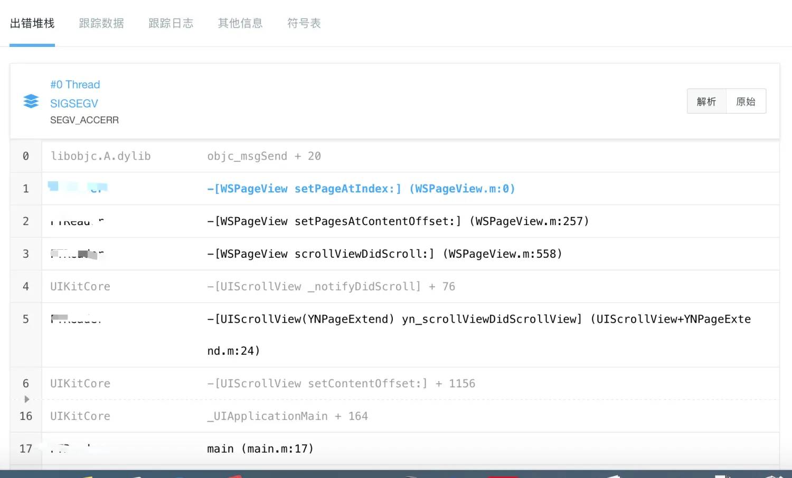

# hopper disassembler定位crash

## 问题

最近发现有个项目出现crash，但是定位不到具体那一行，crash为SEGV_ACCERR异常。

解析原始

SEGV_ACCERR一般是内存问题，比如多线程操作某变量、堆栈非法访问、野指针等

查看跟踪数据
![[3236859-80ddaa93111d1cf1.png.webp]](../image/3236859-80ddaa93111d1cf1.png.webp)

发现crash基本都发生在切换前后台等操作中

无其他线索可查，于是尝试使用逆向工具hopper disassembler

## hopper

hopper disassembler主要就是将Mach-O文件的机器语言代码反编译成汇编代码、OC伪代码。

打开hopper导入应用app文件，

![[3236859-b71f6c28c7a1b6ae.png.webp]](../image/3236859-b71f6c28c7a1b6ae.png.webp)
前面指向的为崩溃地址，使用hopper -> Modify -> Change File Base Address...

后面指向的项目的基地址，使用hopper -> Navigate -> Go to Address or Symbol...。

输入两个地址后就能定位到崩溃的地方
![[3236859-8eae0dd1c1c7c3ac.png.webp]](../image/3236859-8eae0dd1c1c7c3ac.png.webp)

接着结合源码与hopper上的汇编代码很快定位出是野指针问题引起